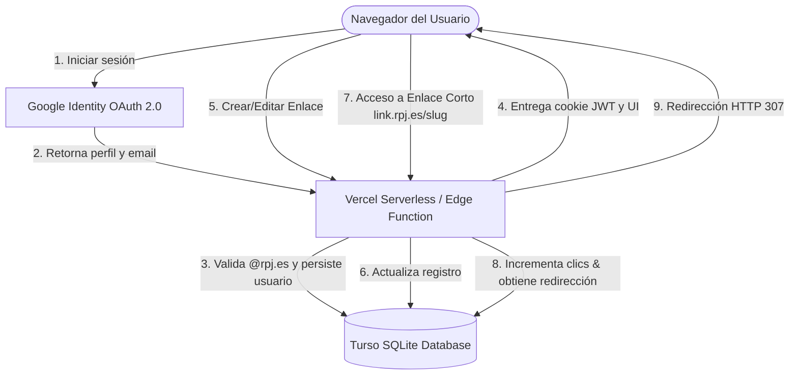
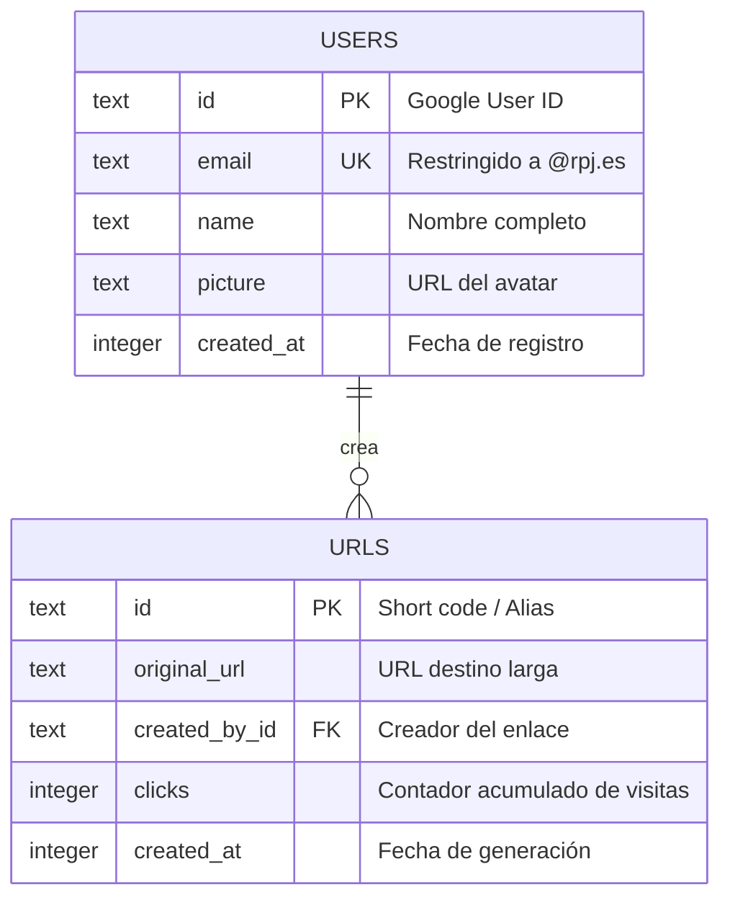

# Arquitectura de la Aplicación: rpj-short-and-qr

Este documento describe la arquitectura, decisiones de diseño técnico, flujos de datos y modelo de base de datos utilizados en la herramienta de Enlaces Cortos y Códigos QR de la Red de Pastoral Juvenil.

---

## 1. Vista General de la Arquitectura

La aplicación está diseñada bajo el patrón de **Server-Side Rendering (SSR)** distribuido utilizando la infraestructura Edge de **Vercel** y la red descentralizada de **Turso** (SQLite distribuido sobre libSQL).

---

## 2. Decisiones Técnicas y de Diseño

### Astro en modo SSR (`output: 'server'`)
A diferencia de los sitios estáticos habituales creados con Astro, este proyecto requiere SSR para:
1.  **Redirecciones dinámicas veloces**: Interceptar las peticiones de enlaces acortados (`/[code]`), consultar la base de datos de manera inmediata y retornar una cabecera de redirección `307 Temporary Redirect` (para evitar que el navegador cachee permanentemente la ruta y nos permita contar los clics en cada visita).
2.  **Seguridad y endpoints de API**: Alojar los controladores de autenticación de Google y la lógica CRUD de creación de enlaces sin necesidad de un backend o servidor de Node.js independiente.

### Turso (libSQL/SQLite)
SQLite es idóneo para acortadores de enlaces debido a que las consultas por clave primaria (`id` del slug) se resuelven en tiempos inferiores al milisegundo. Turso distribuye réplicas de la base de datos de manera global, permitiendo lecturas extremadamente rápidas desde cualquier parte del mundo.

### Sesiones basadas en Cookies HTTP-Only y JWT
En lugar de depender de almacenamiento del lado del cliente inseguro (como `localStorage`), las sesiones de usuario se gestionan mediante tokens JWT almacenados en una cookie con las directivas:
- `HttpOnly`: Previene que scripts maliciosos accedan al token (protección contra ataques XSS).
- `SameSite=Lax`: Protege contra falsificación de peticiones en sitios cruzados (CSRF).
- `Secure`: Fuerza el envío del token exclusivamente a través de canales encriptados HTTPS en producción.

---

## 3. Modelo de Datos (Esquema Drizzle)

El diseño de datos es plano y altamente indexado por claves primarias para maximizar el rendimiento.

### Tabla `users`
Persiste los datos mínimos del miembro de la RPJ que inicia sesión por Google.
- `id` (Clave primaria): Almacena directamente el ID único que nos provee Google.
- `email`: Índice único para control de concurrencia y validaciones de seguridad.

### Tabla `urls`
Almacena los redireccionamientos.
- `id` (Clave primaria): Contiene el alias acortado (ej: `verano26`). Al ser clave primaria, SQLite crea un índice B-Tree automático que optimiza las búsquedas de redirección a O(log N).
- `clicks`: Campo entero de actualización concurrente rápida (`sql`${urls.clicks} + 1``).

---

## 4. Flujos Clave de la Aplicación

### A. Autenticación y Restricción de Dominio

1. El usuario hace clic en "Iniciar sesión con Google".
2. La app redirige al consentimiento de Google OAuth pasándole un URI de callback dinámico (`/api/auth/callback`).
3. Google valida las credenciales y devuelve un `code` temporal al callback.
4. El servidor de la app intercambia ese `code` por un token de acceso a la API de Google de forma segura en segundo plano.
5. Se consulta el correo y nombre del usuario.
6. **Validación Crítica**: Si el email no termina en `@rpj.es`, se aborta el flujo y se redirige con un parámetro de error a la landing page.
7. Si es correcto, se registra al usuario (upsert) en Turso DB, se genera un JWT firmado con `JWT_SECRET` y se deposita en una cookie del navegador.

### B. Generación de Códigos QR Personalizados en el Cliente

Para ahorrar recursos y ancho de banda en nuestro hosting gratuito (Vercel Serverless), la generación de los códigos QR se realiza enteramente en el navegador del usuario utilizando la librería `qrcode` combinada con la API de Canvas de HTML5.

1. Al renderizar el QR con logo, la app inicializa un canvas oculto en memoria.
2. Dibuja los módulos del código QR con el color y fondo seleccionados en la UI, utilizando un nivel de corrección de errores **H** (High, hasta 30% de restauración de datos).
3. Superpone el logotipo oficial `logo.webp` en el centro exacto del canvas respetando un recuadro de protección del color de fondo seleccionado para que los ojos del lector QR no se confundan.
4. Exporta el canvas a una URL de imagen base64 (`canvas.toDataURL()`), la cual se inyecta en el atributo `src` de la tarjeta de descarga y visor modal.

---

## 5. Middleware y Seguridad

El archivo `src/middleware.ts` intercepta todas las peticiones entrantes antes de que Astro procese las páginas y endpoints:
- Extrae la cookie `session_token`.
- Verifica la validez del JWT contra la firma secreta.
- Inserta los datos del usuario decodificados directamente en el objeto global `Astro.locals.user` para que estén disponibles en cualquier página o componente sin tener que volver a decodificar el token.
- Deniega de forma inmediata con un HTTP `401 Unauthorized` cualquier petición `POST`, `PATCH` o `DELETE` al endpoint `/api/shorten` si no existe una sesión válida e inyectada.
